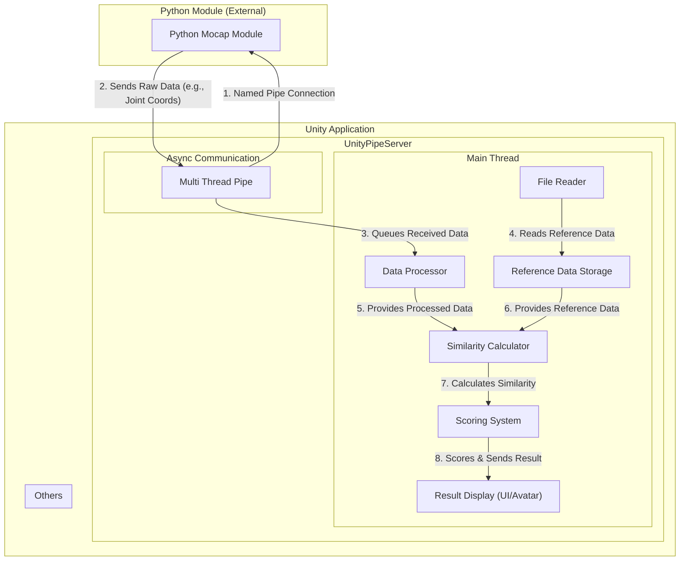

# Just Move

---

## 📖 프로젝트 개요 (Overview)

> 이 프로젝트는 Unity C# 환경과 외부 Python 모듈을 파이프 통신으로 실시간으로 연동하여 유저의 포즈 데이터를 계산하고, 화면의 댄서와의 유사도를 측정하여 점수를 매기는 게임입니다.

---

## ✨ 주요 기능 (Key Features)

* **비동기 파이프 통신**: `Named Pipe`를 사용하여 Unity와 Python 프로세스 간의 안정적이고 효율적인 IPC(Inter-Process Communication)를 구현합니다.
  > lightweight Pose 모델에서 18개의 관절의 좌표정보를 받아옵니다.
* **멀티스레딩**: 통신 파트를 별도의 스레드에서 처리하여 Unity 애플리케이션의 성능 저하를 방지합니다.
  > 적용 전 약 8~10fps에서 약 60fps으로 개선되었습니다.
* **실시간 데이터 계산**: Python에서 전송된 데이터를 실시간으로 계산합니다.

 > 각도를 구할 관절의 좌표값과 인접한 두 관절의 좌표값을 내적을 이용해 각도를 구합니다.

* **데이터 기반 유사도 측정**: 사용자의 실시간 데이터와 저장된 전문가 데이터를 비교하여 동작의 정확도나 유사도를 점수로 평가합니다.
 > 18개의 좌표정보를 이용해서 계산한 값들을 비교합니다.

  
* **움직임을 이용한 UI조작**: 양손을 커서로 사용하여 UI를 조작할 수 있습니다.

https://github.com/user-attachments/assets/9e451239-b167-4574-8525-ceb49f47d018

---

## 🛠️ 기술 아키텍처 및 동작 흐름 (Architecture & Flow)

Project for college graduation
컴퓨터 종합설계
진행사항 - https://sneaky-beam-afe.notion.site/047b82bcab714931a004b84d5f16613e

코드 위치 : https://github.com/sssukh/MocapScripts/tree/master/Scripts

플레이 영상
https://youtu.be/Vk-YywMpDpM
